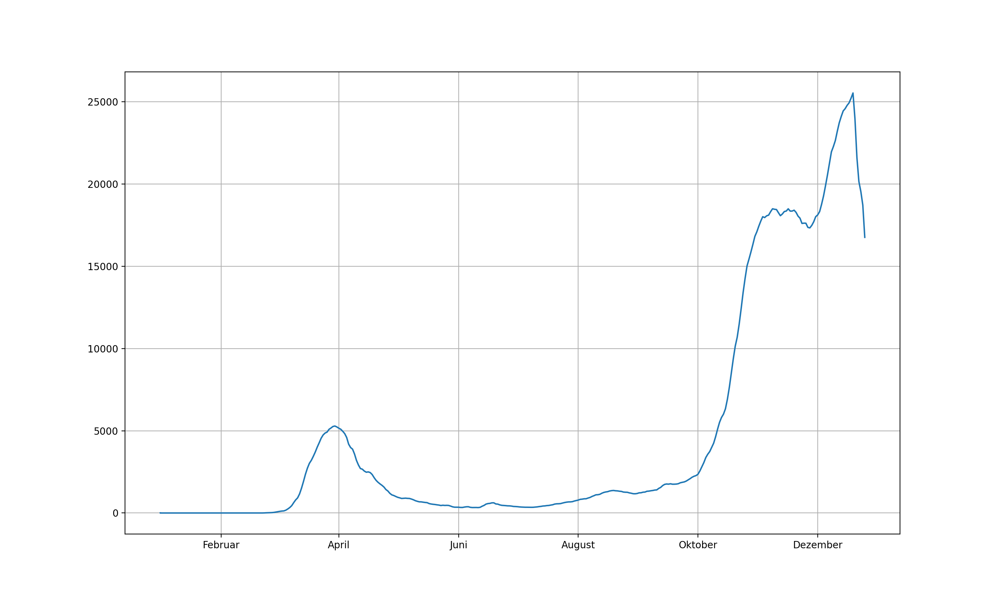
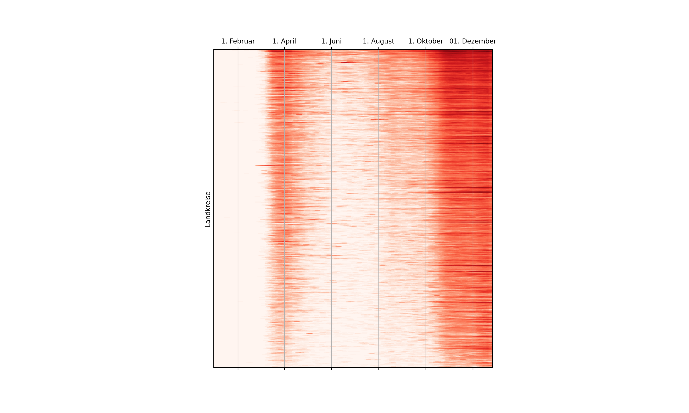
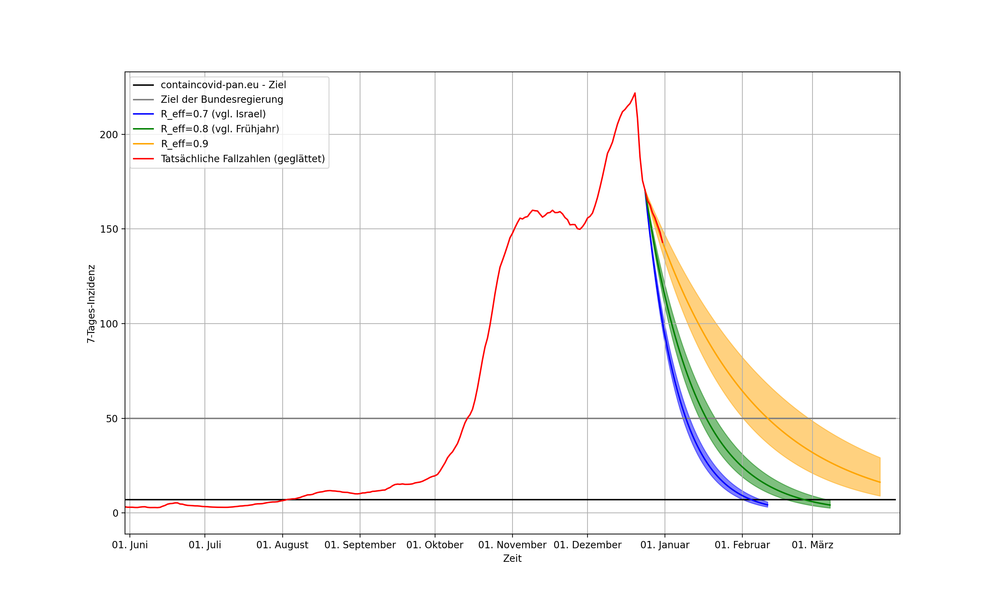

# ZeroCovid: Aktuelle Situation & Zukunfts-Szenarien
Basierend auf den offiziellen RKI-Fallzahlen kann mit diesen Python-Skripten der Verlauf der Neuinfektionen sowohl für Gesamtdeutschland als auch auf Landkreisebene dargestellt werden. 

Interessanter ist vermutlich die Möglichkeit zur Darstellung von Zukunftsszenarien. Hintergrundinformationen zur Methodik ist in der [Erläuterung](description/Grundlagen.pdf) zu finden. Im Wesentlichen werden für verschiedene, jeweils konstante Reproduktionszahlen ungefähre Verläufe der Neuinfektionen dargestellt.

Im aktuellen Stand (30. 12. 2020) dienen dabei die geglätteten Neuinfektionen am 24. 12. den Ausgangspunkt, um Feiertag-bedingte Schwankungen zu umgehen. 

# Beispiele
## Verlauf der Fallzahlen in Deutschland

*Stand: 30. 12. 2020*

## Qualitativer Verlauf der Fallzahlen in Landkreisen

*Stand: 30. 12. 2020*

## Szenarien für die Inzidenz
**Hinweise**

Bei den gezeigten Szenarien handelt es sich **nicht** um Vorhersagen. Sie erlauben allerdings eine Abschätzung, wie schnell Reduktionen von Neuinfektionen prinzipiell möglich wären: Weniger Kontakte in Innenräumen, größere Abstände und weniger Kontakte insgesamt führen zu einem niedrigeren R-Wert. 
>
> *Beispiel:* Hätten Sie bei `R=1` zehn Kontakte, hätten Sie für `R=0.9` noch neun Kontakte oder einen Kontakt mit Abständen draußen statt in Innenräumen. 
> 
> Mit Verzicht auf einen weiteren Kontakt, erhalten Sie `R=0.8`. In diesem Fall werden niedrigere Fallzahlen **deutlich** schneller erreicht als  mit `R=0.9`. 

Bei `R=0.7` halbieren sich die Fallzahlen circa jede Woche. 

*Stand: 04. 01. 2021 (Szenarien beginnen am 24. Dezember 2020)*