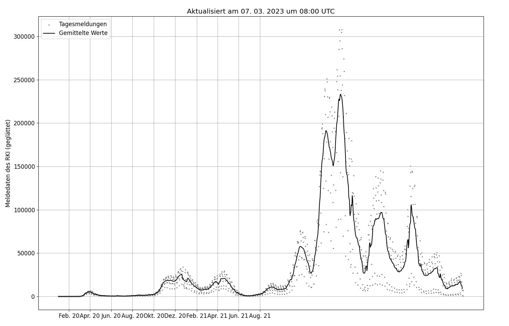
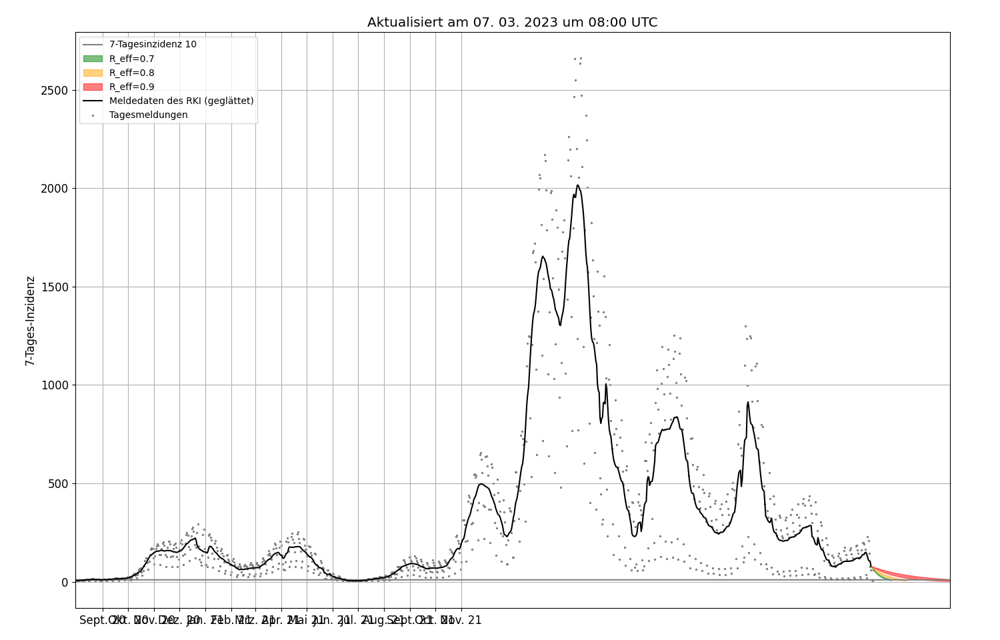

# Covid19: Aktuelle Situation & Zukunfts-Szenarien
> **Aktueller Hinweis zur "#ZeroCovid"-Initiative**
>
> Auch wenn das Github-Repository den Namen "ZeroCovid" trägt, unterstütze ich nicht die Initiative, die eine Stilllegung der Wirtschaft fordert ([zero-covid.org](https://zero-covid.org)). Das Repository ist entstanden, bevor diese Inititative öffentlich wurde. 

Mit diesem Python-Skripten kann der Verlauf der gemeldeten Neuinfektionen (nach Meldedatum) sowohl für Gesamtdeutschland als auch auf Landkreisebene dargestellt werden.

Interessanter ist vermutlich die Möglichkeit zur Darstellung von Zukunftsszenarien. Die Beschreibung zur Methodik wird aktuell angepasst, im Wesentlichen werden aber einfach für verschiedene, jeweils konstante Reproduktionszahlen ungefähre Verläufe der neu gemeldeten Infektionen dargestellt. Die alte Beschreibung finden Sie [hier](description/Grundlagen.pdf). Inzwischen wird allerdings eine etwas andere Definition der Reproduktionszahl genutzt. 

# Beispiele
## Verlauf der Fallzahlen in Deutschland

*Wird jeden Tag um 08:00 Uhr UTC aktualisiert. Die letzten drei Tage werden nicht angezeigt.*

## Qualitativer Verlauf der Fallzahlen in Landkreisen

*Wird jeden Tag um 08:00 Uhr UTC aktualisiert. Die letzten drei Tage werden nicht angezeigt.*

## Szenarien für die Inzidenz
**Hinweise**

Bei den gezeigten Szenarien handelt es sich **nicht** um Vorhersagen. Sie erlauben allerdings eine Abschätzung, wie schnell Reduktionen von Neuinfektionen prinzipiell möglich wären: Weniger Kontakte in Innenräumen, größere Abstände und weniger Kontakte insgesamt führen zu einem niedrigeren R-Wert. 
>
> *Beispiel:* Hätten Sie bei `R=1` zehn Kontakte, hätten Sie für `R=0.9` noch neun Kontakte oder einen Kontakt mit Abständen draußen statt in Innenräumen. 
> 
> Mit Verzicht auf einen weiteren Kontakt, erhalten Sie `R=0.8`. In diesem Fall werden niedrigere Fallzahlen **deutlich** schneller erreicht als  mit `R=0.9`. 

Bei `R=0.7` halbieren sich die Fallzahlen circa jede Woche. 

*Wird jeden Tag um 08:00 Uhr UTC aktualisiert. Die Szenarien beginnen vier Tage zuvor.*